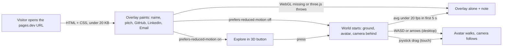
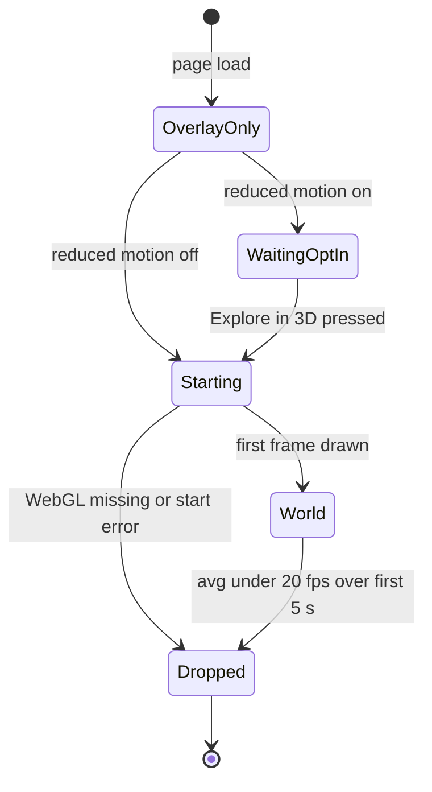

# Walking skeleton

**Version:** v1 · **Status:** Draft · **Type:** Skeleton · **Project type:** Web UI

**Shape doc:** docs/specs/portfolio-website/shape.md
**Depends on:** None
**Page:** _(added at the end of pause 3)_

One deployed page at a real URL: a placeholder avatar on flat ground that
walks with keys on desktop and a joystick on a phone, under a plain HTML
overlay with Dzafran's name, pitch and three links. It ships first because
every risky rail in the plan (3D, touch, the no-3D fallback, deploy, CI)
gets proven here, and a client landing on it still knows who Dzafran is and
how to get in touch.

## Problem

A client or recruiter checking Dzafran out has GitHub and LinkedIn: a repo
list and a job history, neither of which looks like the work. There is no
page that shows a polished, moving interface and says "here is how to hire
me". Slice 0 gives that page a home and proves the site can be a 3D world
without breaking for anyone who cannot run one.

## Stack decisions

The decision record for the whole project. Asked one at a time on
2026-09-16; the owner picked each.

| Decision | Choice | Why |
| -------- | ------ | --- |
| Language and framework | Vite, TypeScript, three.js. No UI framework. | Smallest bundle, closest to the O4 spike, and the owner learns three.js directly rather than through a wrapper. Panels are plain HTML. |
| Database | None | Static site, nothing runs at request time (shape O3). Content is files in the repo. |
| Host and deploy target | Cloudflare Pages, free `*.pages.dev` subdomain | Free, per-branch preview URLs so a slice can be checked on a phone before it merges, custom domain later is one setting (shape O2). |
| CI | GitHub Actions | Runs the browser test and the page-weight check on every push, deploys to Cloudflare Pages only when both pass. Cloudflare's own build would deploy without a test gate. |
| Test runner and e2e | Playwright only | Drives a real Chromium at desktop and phone sizes, emulates touch and reduced motion. Slice 0 has no pure logic to unit-test; Vitest comes when a slice has some. |
| Package manager | npm | Ships with Node, nothing extra to install anywhere. |
| Models | Placeholder shapes in slice 0. Blender is a fit for owner-made models later, deferred to `/design system` (shape O7). | Blender exports glTF, which three.js loads natively. It is a second learning curve and the slower one, and model size counts against the page-weight budget, so the art style is chosen first and then pack-or-model. |

## Slice test

| Check | Result |
| ----- | ------ |
| Cuts every layer it needs | yes: overlay and 3D canvas on screen, static build, CI, deploy to a real URL. No endpoint or table exists to cut. |
| One e2e test walks it | yes: one Playwright spec walks the five scenarios below on one page, switching viewport, touch and reduced-motion emulation. |
| Worth shipping alone | yes: a client sees Dzafran's name, pitch and links, and can email or open GitHub or LinkedIn. |
| Fits (≤5 scenarios, ≤2 areas) | yes: 5 scenarios, two areas (overlay, world). |

**Path:** full. Greenfield, new interface, new dependencies, first deploy.

## User story

As a client or recruiter opening the link from Dzafran's CV, I want to see
who Dzafran is and how to reach them within a second, and then, if my device
can, walk an avatar around a small world, so that I get a contact card
immediately and a taste of the interface work without being made to wait for
it.

## Flow



The overlay paints first for everyone, then the visitor gets the world, an
opt-in button, or a note, depending on their setting and device, and in the
world the avatar walks with keys or a joystick.

## States



`Dropped` shows the overlay and one line of text, "3D turned off on this
device." There is no way back from `Dropped` without a reload.

## Acceptance criteria

Real values used below: desktop viewport 1280x800 with a keyboard; phone
viewport 390x844 with touch, the size of an iPhone 14. "Avatar moved" means
its world position changed by at least 0.5 units.

```gherkin
Scenario: Desktop visitor walks the avatar
  Given a visitor opens the site at 1280x800 with a keyboard on 2026-09-20
  When the page loads
  Then the overlay with "Dzafran", the one-line pitch, and the GitHub, LinkedIn and Email links is visible before any 3D frame is drawn
  And within 3 seconds the world is drawn: flat ground, a placeholder avatar, the camera behind and above it
  When the visitor holds W for 1 second
  Then the avatar has moved at least 0.5 units forward and the camera has followed
  And arrow keys move it the same way

Scenario: Phone visitor walks the avatar with the joystick
  Given a visitor opens the site at 390x844 on a touch device
  When the world is drawn
  Then an on-screen joystick sits in the bottom-left corner, above the overlay links, and the overlay is still readable
  When the visitor drags the joystick knob right by 60 px and holds for 1 second
  Then the avatar has moved at least 0.5 units to the right and the camera has followed

Scenario: Reduced motion gets an opt-in
  Given a visitor whose OS has "reduce motion" on opens the site
  When the page loads
  Then the overlay is visible, nothing on the page moves, and a button labelled "Explore in 3D" is shown
  And no 3D code has run
  When the visitor presses "Explore in 3D"
  Then the world starts exactly as in the desktop scenario

Scenario: Device cannot start the 3D
  Given a visitor whose browser has no WebGL, or where three.js throws while starting
  When the page loads
  Then the overlay is visible with the note "3D turned off on this device."
  And no 3D canvas is on the page
  And the links still work

Scenario: 3D starts but runs badly
  Given a visitor whose device draws the world at an average of 12 fps
  When 5 seconds have passed since the first 3D frame
  Then the world and joystick are removed, the overlay stays, and the note "3D turned off on this device." is shown
  And a device averaging 20 fps or better over those 5 seconds keeps the world
```

## Scope

**In:**

- The overlay: name, one-line pitch, GitHub, LinkedIn and Email links. Plain HTML and CSS, paints before any script. Always on top of the world.
- The world: flat finite ground, a placeholder avatar (capsule and sphere as in the O4 spike), a camera that follows behind. The avatar stops at the ground edge.
- Controls: WASD and arrow keys on desktop, an on-screen joystick on touch devices.
- The three fallbacks above: reduced-motion opt-in, cannot-start note, runs-badly drop.
- One Playwright spec walking the five scenarios, run in GitHub Actions on every push.
- A page-weight check in CI: the built output the first screen loads, gzipped, is 300 KB or under in total, and the overlay's HTML and CSS are 20 KB or under. Over budget fails the push.
- Deploy to Cloudflare Pages from the same workflow when the test and the check pass. Preview URL per branch, production URL on main.

**Out:**

- Any zone, panel or CV content beyond the overlay: slice 1 (projects) and slice 2 (work, education, certifications).
- A CV PDF link: owner decided against it for slice 0 (2026-09-16). Add later if wanted.
- Avatar walk and idle animation, lighting polish, ambient motion, a modelled avatar or world: arrive inside the zone slices, per the shape doc's rules.
- Camera control by the visitor (orbit, zoom): not needed until there is something to look at. Slice 1.
- Lowering quality instead of dropping the 3D: rejected 2026-09-16, it can still stutter.
- A retry button after a drop: rejected 2026-09-16. Reload is the retry.
- A custom domain: shape O2, when one is bought.

## Open items

Rows O1 to O13 live in the shape doc. The ones slice 0 rests on are carried
here with their state; new rows start at O14.

| ID | What | Type | Raised at | Owner | Status | Answer |
| -- | ---- | ---- | --------- | ----- | ------ | ------ |
| O2 | Domain name | question | shape | user | Resolved | None yet. Slice 0 ships on a free `*.pages.dev` subdomain. |
| O3 | No backend, static site | assumption | shape | user | Resolved | Confirmed. Nothing runs at request time. |
| O4 | 3D world runs on a phone | unproven | shape | poc | Resolved | Pass on an iPhone (iOS 18.4): 55 to 60 fps, 130 KB gzipped, first 3D frame at 2.2 s. |
| O7 | Where models come from | question | shape | design | Open | Deferred to `/design system`. Slice 0 uses placeholder shapes. Owner asked about Blender: a fit for owner-made models, glTF export loads natively in three.js, but it is a second learning curve and model size counts against the 300 KB budget. Style first, then pack-or-model. |
| O9 | Overlay and panels are the accessibility path, no separate plain CV page | assumption | shape | user | Resolved | Confirmed by owner 2026-09-16. The overlay alone is the fallback for every device that cannot run the 3D. |
| O13 | Mid-range Android unmeasured | flag | shape | user | Accepted risk | Owner's condition is met by scenarios 4 and 5: a device that cannot start or cannot sustain 20 fps gets the overlay and a note. |
| O14 | Exact overlay text: the name as it should appear, and the one-line pitch. | question | spec p1 | user | Open | Name: "Dzafran" (owner, 2026-09-16). Pitch: owner wants it framed as an AI engineer, wording still to pick. Note for slice 1: the projects zone should then lead with AI work, since the shape doc's problem statement leads with interface work. |
| O15 | Which email address goes public on the site as the mailto link. | question | spec p1 | user | Resolved | ahmaddzafranmohamadbustaman@gmail.com (owner, 2026-09-16). |
| O16 | The exact LinkedIn profile URL. | question | spec p1 | user | Resolved | linkedin.com/in/ahmaddzafranmohamadbustaman (owner, 2026-09-16). GitHub is github.com/dzaffren. |
| O17 | Deploying to Cloudflare Pages from GitHub Actions needs a Cloudflare account, a Pages project, and an API token stored as a GitHub Actions secret. Owner creates these; CI cannot. | flag | spec p1 | user | Resolved | Owner agreed 2026-09-16 to set these up before the deploy step. Pause 3 lists the exact secret names. Everything else in the slice builds and tests without them. |

_Never delete this section or its rows. See references/ledger.md._
